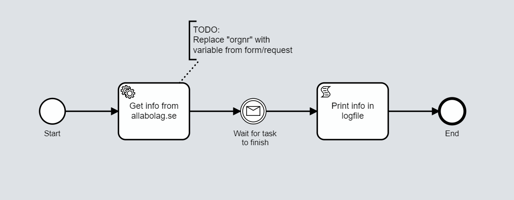

# Onify Blueprint: Get company info from allabolag.se

This is a very simple "RPA" example where we get information (CEO and Phone) from allabolag.se using Selenium PowerShell module. 

## Screenshots

## Requirements

* Onify Hub v2
* Onify Agent (tagged `agent`, running Windows, in robot mode)
* [Selenium PowerShell Module](https://github.com/adamdriscoll/selenium-powershell) (on Onify Agent)
* Mozilla Firefox (on Onify Agent)
* Onify Flow license
* Camunda Modeler 4.4 or later 

## Included

* 1 x Flows
* 1 x Script (Powershell, agent based)

## Setup

* Copy `getInfoFromAllabolag.ps1` to Onify Agent scripts folder (eg. `.\scripts`)  

## Run 

1. Open `*.bpmn` in Camunda Modeler
2. Click `Start current diagram`

## Support

* Community/forum: https://support.onify.co/discuss
* Documentation: https://support.onify.co/docs
* Support and SLA: https://support.onify.co/docs/get-support

## License

This project is licensed under the MIT License - see the [LICENSE](LICENSE) file for details.
